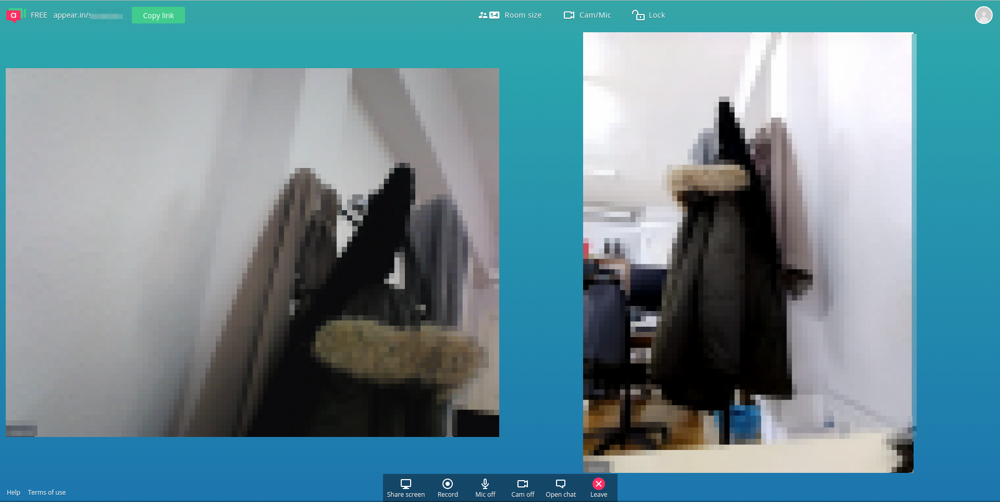

# Reuniones por videoconferencia con hasta 4 miembros: Appear.in

[Appear](https://appear.in/) es un web que permite hacer videoconferencias de forma rápida sin necesidad de instalar ningún tipo de software.

Sólo es necesario que esté registrado (en la versión Free) uno de los participantes en la videoconferencia.

Un usuario registrado puede crear un solo "room" donde puede llevarse acabo una videoconferencia con hasta 4 participantes. La ventaja es que el resto de participantes no necesitan registrarse ni tener ninguna cuenta específica de correo con lo que es muy ágil. El usuario que ha creado el room puede enviar un link a los demas. Este link tiene la forma 

https://appear.in/nombredelroom

Una vez dentro de la videoconferencia, todos pueden verse, hablar e incluso compartir su escritorio o una ventana para poder debatir sobre un documento o imagen.

.

En esta presentación puedes ver como hacer una videoconferencia por appear.in

<iframe src="https://docs.google.com/presentation/d/e/2PACX-1vQzzIKMw961AucVDPkECxEQKJ-Y9TXVLhH5qz49yarpvG2D_DSFLOML9azxnF0HdCTJPRySEBFuadaS/embed?start=false&loop=false&delayms=3000" frameborder="0" width="960" height="569" allowfullscreen="true" mozallowfullscreen="true" webkitallowfullscreen="true"></iframe>

        Presentación de Carmen Julve Tiestos