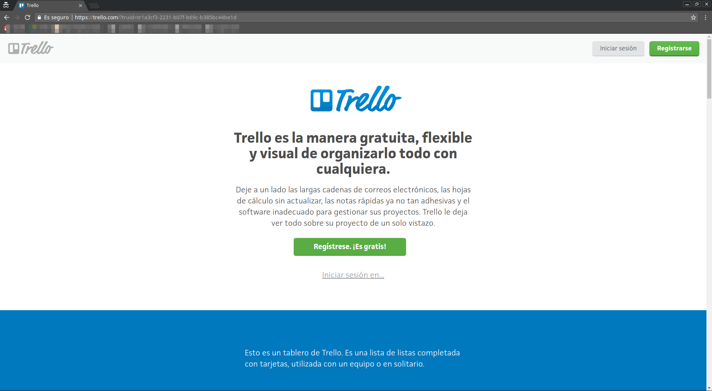
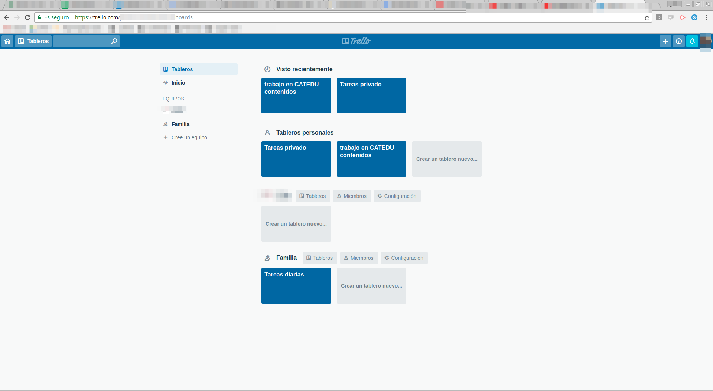
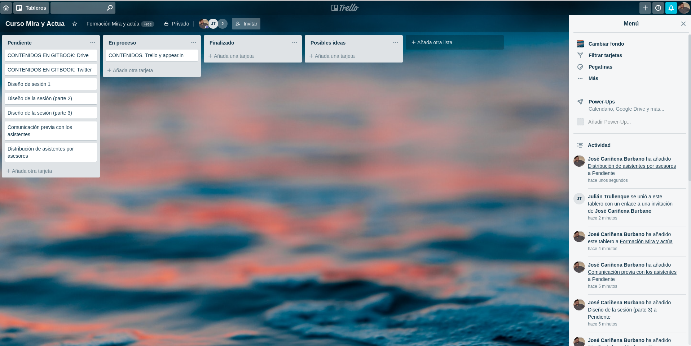

# Trello en ordenador: Aplicación Web.

## Registro

No necesitas descargarte nada para usar Trello en tu ordenador.

Puedes entrar en www.trello.com

.

Una vez ahí puedes crear un registro o entrar con tu cuenta Google.

## Tableros

Una vez dentro aparece tu página con tus diferentes tableros:

En esta parte se pueden crear nuevos tableros o nuevos equipos o bien acceder a uno de los tableros.

Estos tableros pueden ser individuales o compartidos.

## Un ejemplo de tablero.

Este es el tablero que se está usando a modo de ejemplo en este curso:

A las tarjetas se les puede añadir una etiqueta (por colores) para indicar prioridad o tipo de tareas. Puede añadírseles una fecha de finalización o incluso una checklist (para subdividirlas).

También puede ser asignada a cualquiera de los miembros del equipo que comparte el tablero.

## Aplicación móvil.

Trello dispone también de una app que permite emplearlo desde un dispositivo móvil.